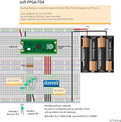
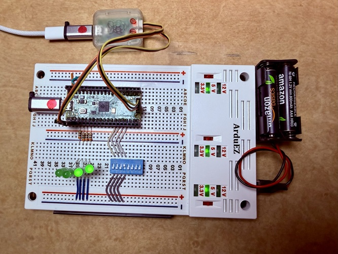
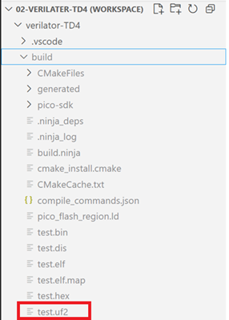

# Soft-FPGA-TD4


- 2025/10/30 `Fritzing`ブレッドボード図を追加しまいた。

[](./images/soft-FPGA-TD4-Sketch-1815x1832.png)

- 2025/10/28 `0.1alpha` リリースしました。
  - [soft-FPGA-TD4-0.1alpha](https://github.com/open-tommie/Soft-FPGA-TD4/releases)
- 2025/10/25 __まだ編集中ですが__
  - 実行手順を書きました。
  - git cloneしてビルドできるはず。

- Verilogで実装したシンプルな4bit CPU TD4をverilatorでC++ソースへ変換し、`Raspberry Pi Pico2` 上で動作するようにしました。
- __FPGAは不要__ です。pico2のみで動きます。
- ハードウェアFPGAなしでverilogソースが動く！だから __`soft-FPGA`__ です。
- `soft-FPGA`は`Software Defined FPGA`の略です。



---

## 開発環境

- [開発環境インストールの詳細手順](./etc/90-env-install.md)
  - Windows11
    - VSCode
      - `pico SDK` VSCode拡張
    - WSL2
      - Ubuntu24
        - verilator 5

---

## `soft-FPGA`実行手順

- WSL2: git cloneでファイル取得

  ```text
  $ git clone https://github.com/open-tommie/Soft-FPGA-TD4.git
  ```

- Windows11: ファイルエクスプローラでクローンしたSoft-FPGA-TD4フォルダーを開き、`VSVodeワークスペースファイル`をダブルクリック

  ```text
  ./Soft-FPGA-TD4/verilator-TD4/02-verilater-TD4.code-workspace
  ```

- VSCode: 右下の`□ Compile`アイコンをクリックしてビルドする。成功すると以下のようなログを出力する。

  ```text
  [101/101] Linking CXX executable test.elf
  *  Terminal will be reused by tasks, press any key to close it. 
  ```

- VSCode: buildフォルダーに`test.uf2`が作成されたことを確認する。

  

- UF2ファイルをpico2で実行する：
  - pico2の`BOOTSEL`ボタンを押したまま、USBケーブルでPCと接続します。
  - 接続後、`BOOTSEL`ボタンを離します。
    - PC側で、Pico 2が __マスストレージデバイス（RPI-RP2）__ として認識されます。
    - 認識されない場合: ケーブルを抜き、再び`BOOTSEL`を押しながら接続を試してください。
  - UF2ファイルをコピー
    - UF2ファイルを、RPI-RP2ドライブにドラッグアンドドロップします。
    - コピーが完了すると、Pico2が自動的にリブートします。

（TBD)

- リブートするとLEDが点滅します
- TeraTermでログ出力を確認

---

## Debug Probeで書き込み

(TBD)

- 書き込み
- ログの確認
  
---

## verilatorでverilogをC++変換

(TBD)

---

## pico2接続

（TBD)

- ログ解説

---

## 解説

- [verilatorマニュアル](https://veripool.org/guide/latest/)
  - verilatorで変換したC++ソースはLinux向けになっています。
  - そのままではpico2 SDK C++ではコンパイルエラーがでます。
  - エラーがでないように修正し、pico2で実行できました。

- verilogソース
  - [TD4.v](./verilator-TD4/TD4.v)
  - fork元のsimpleTD4を修正して使っています。
  - fork元の解説が充実しているので是非、参照して下さい。
    - [simpleTD4](https://github.com/asfdrwe/simpleTD4)
      - Verilogで実装したシンプルな4bit CPU TD4の実装です。
      - [Sipeed Tang Nano](https://tangnano.sipeed.com/en/) でも動作します。
      - [TD4\_details\_jp.md](TD4_details_jp.md) でコードの解説をしています。

- [main.cpp](./verilator-TD4/main.cpp)
  - top: verilatorが出力したTD4.vのモデルインスタンス
    - verilogシミュレーション用のインスタンス
  - 以下を繰り返す
    - DIPスイッチをINレジスタへ設定する
      - 4bit DIPスイッチの状態をpico2のGPIOから読む
      - 読んだ値を top->in_port(INレジスタ)へ設定する
    - top->eval(): 評価：TD4.vの状態を更新する
    - LEDへOUTレジスタを設定する
      - top->out_port(OUTレジスタ)の値をpico2のGIPOでLEDへ出力する 
    - top->clock = !top->clock: クロックを反転する
    - sleep: 時間まち
  - top->eval()の処理時間は6μ秒ぐらいなので、最大クロック周波数は50kHzぐらいの見込み。
    - デバッグ文を出力すると遅くなる
    - GPIOで遅くなる。

---

## FAQ

### Q: verilator出力のC++ソースを毎回修正する必要あるか？

- A: __ありません。__
- verilatorはLinux向けビルドを想定しているので、出力C++ソースではpthread mutexを使っています。
- pico SDKはpthread mutexをサポートしていないので、そのままではコンパイルエラーになります。(verilatorのフラグオプションで thread 1に指定してもmutexを使う)

- 何もしないダミーmutexクラスをヘッダーファイル`stub_mutex.h`で定義することにより、pico SDK C++でビルドできるようにしています。
- 通常であれば、`stub_mutex.h`をverilator出力のCPPソースの先頭に`#include "stub_mutex.h"`と書けばコンパイルできるようになります。
- しかしながら、verilator変換は何度も実行するので、その度に毎回出力ソースファイルを修正するのは手間がかかります。
- そこで、ヘッダーファイル`stub_mutex.h`を読み込むようにg++フラグオプションで指定します。

  ```bash
  g++ -include stub_mutex.h -o output source.cpp
  ```

- '-include` オプション
  - 特定のヘッダーファイルを強制的にインクルードします。ソースコードに `#include` を書かなくても、指定したヘッダーファイルが自動的にインクルードされます。
- 実際は`CMakeLists.txt`に書かれています。
  - [CMakeLists.txt](./verilator-TD4/CMakeLists.txt)

  ```text
      # dir_obj/*.cppに -include stub_mutex.h を適用
      set_source_files_properties(${VERILATOR_SOURCES} PROPERTIES COMPILE_FLAGS "-include stub_mutex.h")
  ```

- 結論
  - verilatorを実行しても出力C++ソースを修正する必要はありません。

---

## メモ

[メモ](./etc/91-memo.md)

---

## fork元からの引用

### simpleTD4

- [TD4\_details\_jp.md](TD4_details_jp.md) でコードの解説をしています。

---


---
